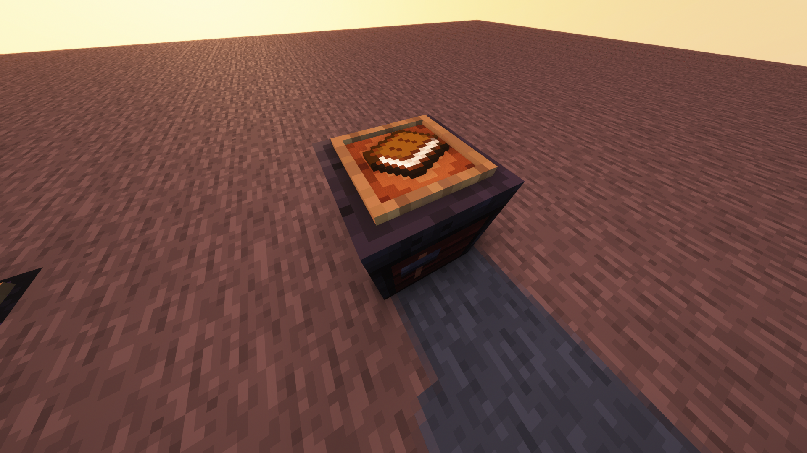
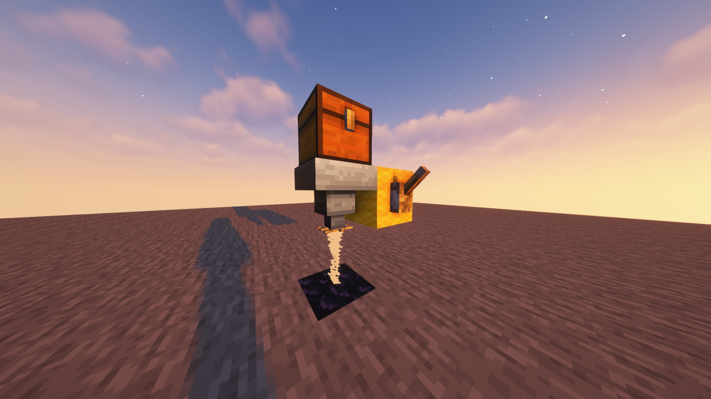

[Planet Minecraft page](https://www.planetminecraft.com/data-pack/enchanting-overhaul/)

Assets by [@Tera_Katzen](https://twitter.com/Tera_Katzen)

I do not enjoy using the vanilla enchanting system, so I made my own. Instead of arbitrary knowledge pouring out of some untitled books that seep into my tools, I wanted something that you physically apply to your item to give it special properties, so I came up with an upgrade system in the vein of *Baldur's Gate* and *Bloodborne* that uses various gemstones you attach to your weapons to make them do special stuff.

This datapack adds 11 custom gemstones (or 10 plus platinum, if you're annoying) that can be used to enchant your tools, weapons, and armor (11 because that's how many unique enchantments you can apply to boots and axes by default). All enchantments at all levels for all tools, all weapons, and all armors are obtainable.

## Enchanting Station
I wanted to simply use a smithing table to apply enchantments like how you upgrade diamond tools to netherite, but apparently crafting recipes don't allow NBT manipulation so I can't apply enchantments with custom smithing table recipes, so I settled for a fake smithing table that you just have to look at while squatting.

To create this fake station, simply put a glow item frame on top of a real smithing table and put an amethyst shard on display. This will remove all 3 of those things and spawn a lobotomized and invulnerable shulker inside an immobile falling sand block that looks like a smithing table. To use it, put the item you want to enchant in your mainhand and the gemstone that has the enchantment you want in your offhand, then look at the station and crouch.

To destroy the station, simply remove the block beneath it. Trying to create it in the air will not work because it'll just break immediately. You will get your smithing table, glow item frame, and amethyst shard back.

## Enchantments
| Gemstone | Swords | Axes | Bows | Crossbows | Tridents | Helmet | Chestplate | Leggings | Boots | Tools | Fishing Rods |
| --- | --- | --- | --- | --- | --- | --- | --- | --- | --- | --- | --- |
| Sunstone | Fire Aspect | Fire Aspect | Flame | --- | --- | Fire Protection | Fire Protection | Fire Protection | Fire Protection | --- | --- |
| Moonstone | --- | Silk Touch | --- | --- | Loyalty | Respiration | --- | --- | Frost Walker | Silk Touch | --- |
| Bloodstone | Sharpness | Sharpness | Power | Piercing | Impaling | Protection | Protection | Protection | Protection | --- | --- |
| Jade | Smite | Smite | --- | --- | Channeling | --- | --- | --- | Soul Speed | --- | --- |
| Platinum | Knockback | Knockback | Punch | --- | --- | Blast Protection | Blast Protection | Blast Protection | Blast Protection | --- | --- |
| Pearl | --- | Fortune | --- | --- | --- | --- | --- | --- | Feather Falling | Fortune | Luck of the Sea |
| Opal | Looting | Looting | Infinity | Multishot | --- | Projectile Protection | Projectile Protection | Projectile Protection | Projectile Protection | --- | --- |
| Pyrite | Bane of Arthropods | Bane of Arthropods | --- | --- | --- | Thorns | Thorns | Thorns | Thorns | --- | Lure |
| Larimar | Sweeping Edge | Efficiency | --- | Quick Charge | Riptide | Aqua Affinity | --- | --- | Depth Strider | Efficiency | --- |
| Onyx | Unbreaking | Unbreaking | Unbreaking | Unbreaking | Unbreaking | Unbreaking | Unbreaking | Unbreaking | Unbreaking | Unbreaking | Unbreaking |
| Malachite | Mending | Mending | Mending | Mending | Mending | Mending | Mending | Mending | Mending | Mending | Mending |

All enchantments can only be raised to their normal levels.
- 1st level - 1 gemstone (1 total)
- 2nd level - 1 gemstones (2 total)
- 3rd level - 2 gemstones (4 total)
- 4th level - 4 gemstones (8 total)
- 5th level - 8 gemstones (16 total)

## How to Get Gemstones

### Sifting

 - Place a hopper pointed down. Place an item frame on its underside and put iron bars in it. Put a chest over it. Fill the chest with sand. The sand will get funneled through the iron bars and leave behind any gemstones in the hopper.
 - Can sift sand, red sand, soul sand, and gravel, each with their own drop rates.
 - All sand and gravel that gets sifted will be gone forever, even if it returns nothing.
 - Drops:
	- Gravel:
		- Pyrite (1%)
		- Normal Flint (50%)
	- Sand:
		- Pearl (0.5%)
		- Larimar (0.25%)
	- Red Sand:
		- Larimar (1%)
		- Sunstone (0.5%)
	- Soul Sand:
		- Malachite (0.6%)
		- Bloodstone (0.4%)

### Crushing

 - Place an obsidian block. Place an iron block 2 blocks above it (1 empty space between). Place a piston facing down above that. Place an item frame on the obsidian and put an obsidian in the item frame, then power that sticky piston. The obsidian will be crushed and it might turn into an Onyx.
 - Can also crush most ores, crying obsidian, and gilded blackstone.
 - Drops:
	- Iron ore:
		- Jade (10%)
	- Copper ore:
		- Jade (4%)
	- Gold ore:
		- Platinum (15%)
	- Lapis ore:
		- Larimar (10%)
	- Redstone ore:
		- Sunstone (10%)
	- Emerald and Diamond ores:
		- Opal (20%)
	- Obsidian:
		- Onyx (6.25%)
	- Crying Obsidian:
		- Moonstone (25%)
	- Gilded Blackstone:
		- Bloodstone (20%)
 - Ores will grant only 1 of their usual loot if they do not grant a gemstone.
 - You will need to obtain Moonstone from crushing Crying Obsidian to get any of the other gemstones.

### Chest Loot
 - Gemstones can also be found in chests all over the world, if you prefer to explore.
 - Loot:
	- Village Temples:
		- Jade
	- Pillager Outposts:
		- Malachite
	- Shipwrecks:
		- Pearl
	- Buried Treasure:
		- Pearl
	- Desert Pyramids:
		- Pyrite
		- Larimar
		- Moonstone
	- Jungle Temples:
		- Jade
	- Simple Dungeons:
		- Sunstone
		- Jade
	- Underwater Ruins:
		- Pearl
		- Larimar
	- Mineshafts:
		- Larimar
		- Platinum
		- Jade
		- Sunstone
	- Strongholds:
		- Platinum
		- Jade
		- Opal
	- Woodland Mansions:
		- Jade
		- Malachite
		- Opal
	- Ruined Portals:
		- Moonstone
		- Bloodstone
	- Nether Fortresses:
		- Onyx
		- Platinum
		- Malachite
	- Bastions:
		- Onyx
		- Moonstone
		- Bloodstone
	- End Cities:
		- Sunstone
		- Malachite
		- Moonstone
		- Onyx
		- Opal
